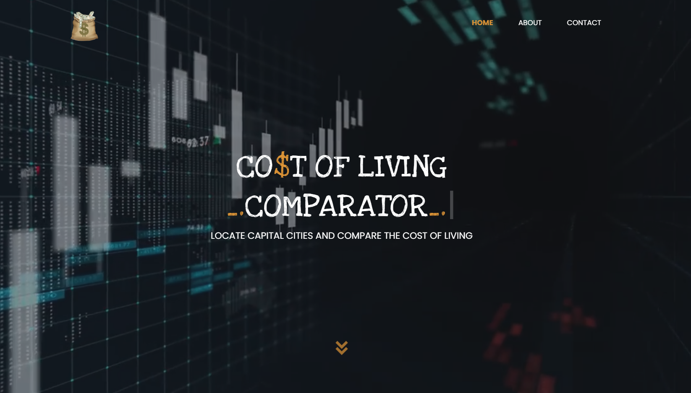

# COST OF LIVING COMPARATOR

## CREATED BY: DANIEL GITHIOMI

## Introduction

This is a website which allows users to locate capital cities around the world and to compare the cost of living in these capitals by making use of multiple APIs

## Website Preview

  

## Compatibility

This projects has been tested on mobiles, tablets and laptops. Thorough testing has ensured that it runs with no problems to report.

## Link to Live Pages

The link to the live pages:

* GitHub Live pages can be found [here](https://https://githiomi.github.io/Cost-Of-Living-Comparator)
* Heroku Live pages can be found [here](https://github.com/githiomi/Cost-Of-Living-Comparator.git)

## Technologies Used

It is made entirely using Visual Studio Code where all the following files were created and modified to achieve the output as you see it.

* HTML 5
* CSS
* Bootstrap
* Javascript
* JQuery
* APIs
** [Country Facts](https://rapidapi.com/richardarthur228/api/country-facts/)
** 

## Requirements

You will need to have the following installed on your system:

* Minimum 4GB of RAM
* Browser (For example: Chrome/Safari/Firefox)

## Setup Instructions

* Git clone [This](https://github.com/githiomi/Cost-Of-Living-Comparator.git) repository into your terminal.  
* Open the folder in your favourite editor (for example Visual Studio Code)
* Install the live server extension on your version of Visual Studio Code
* Open website using the live server extension

## Support and contact details

Contact me through any of the following:

* Slack: danielgithiomi
* Email: danielgithiomi@gmail.com

## License

Click the following to acces the license page: [Click-Here](https://githiomi.github.io/Privacy-Policy/)

Copyright (c) {2022} Dhosio Co.
